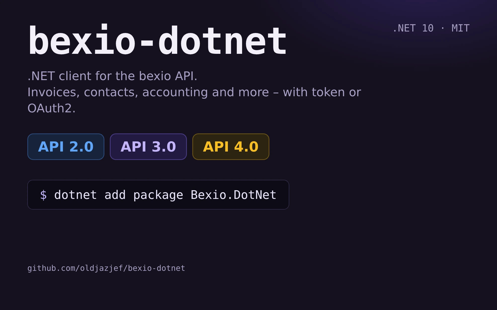

# dotnet core Bexio client



This repository contains a dotnet / dotnet core compatible Bexio client.

Supports **bexio API v2.0 and v3.0**. Every endpoint knows its own version, so both can be used side by side with one api key.
All endpoints offer sync and async (`...Async`) methods, targets .NET 10 (LTS).

#### API 2.0 (`bexio_lib.Interfaces`)
- Sales: orders (`kb_order`), offers (`kb_offer`), invoices (`kb_invoice`), deliveries (`kb_delivery`) incl. issue / revoke / cancel / send / mark as sent / pdf / convert (offer -> order/invoice, order -> invoice/delivery)
- Invoice payments, document positions (invoice / order / offer)
- Contacts, contact relations / groups / sectors, additional addresses, salutations, titles
- Articles, article types, units, stock, stock places
- Projects, project types / states, timesheets, client services, communication kinds, notes, tasks
- Accounts, account groups, countries, currencies, languages, payment types, users, fictional users, company profile

#### API 3.0 (`bexio_lib.Interfaces.V3`)
- Currencies (+ exchange rates), taxes, users (+ `me`)
- Accounting: calendar years, business years, VAT periods, manual entries (+ next reference number), journal
- Banking: bank accounts
- Files: list, upload, download, delete

Entities with write access (`IBexioApiCrudEndpoint`) support `Create`, `Update` and `Delete`; all others `GetById`, `GetAll` and `Search`.
Resources not covered yet can be added by deriving from `BexioApiCrudEndpoint<T>` / `BexioApiFullEndpoint<T>` with the matching `BexioApiVersion`.

If you find something missing or broken, please [report an issue][github-issue] or even better fork the repo and submit a pull request


### How to use

#### Setup

**With dependency injection** (recommended). Registers a typed `HttpClient` (`IHttpClientFactory`), the client, the factory and every single endpoint:

```csharp
// appsettings.json: "Bexio": { "AccessToken": "...", "BaseUrl": "https://api.bexio.com" }
services.AddBexio(Configuration.GetSection("Bexio"));

// or in code
services.AddBexio(o => o.AccessToken = "myApiKey");
```

Options (`BexioOptions`): `AccessToken` (personal access token), `AccessTokenProvider` (async callback, e.g. to refresh OAuth2 tokens), `BaseUrl`, `MaxRetries`, `RetryBaseDelay`, `RetryMaxDelay`, `Timeout`.
The old `services.AddBexioJwt(configuration)` (keys `bexioApiKey` / `bexioApiUrl`) still works.

**Without dependency injection / several bexio accounts**: use the factory

```csharp
var factory = new BexioClientFactory();
var client = factory.Create("myApiKey");     // IBexioClient
```

Requests answered with 429 (rate limit) or 503 are retried automatically (honors `Retry-After`, exponential backoff otherwise).

#### Authentication: personal access token or OAuth2

Two ways to authenticate against bexio are supported:

| | Personal access token (PAT) | OAuth2 (app registered at bexio) |
|---|---|---|
| For | own scripts / internal tools | apps used with several bexio accounts |
| Setup | `AccessToken` in `BexioOptions` | `AddBexioOAuth` + token store |

##### OAuth2 (authorization code flow)

1. Register your app in the bexio developer portal and note client id / secret, set the redirect uri.
2. Register the services. The OAuth tokens are fetched, refreshed shortly before they expire and handed to every API request automatically:

```csharp
services.AddBexio(_ => { });                       // no static token needed
services.AddBexioOAuth(o =>
{
    o.ClientId = "...";
    o.ClientSecret = "...";
    o.RedirectUri = "https://myapp.example/bexio/callback";
    o.Scopes = new[] { "contact_show", "kb_invoice_edit" };   // "openid" and "offline_access" are added for you
});
services.AddSingleton<IBexioTokenStore, MyDatabaseTokenStore>();   // see below
```

Or bind from configuration: `services.AddBexioOAuth(Configuration.GetSection("BexioOAuth"))`.

3. Send the user to bexio and handle the redirect:

```csharp
// 1) redirect the user
var url = _oauth.GetAuthorizationUrl(state);        // IBexioOAuthClient, "state": random value, verify it on the callback
return Redirect(url);

// 2) on your redirect uri
var token = await _oauth.ExchangeCodeAsync(code);
await _tokenStore.SaveAsync(token);
```

From then on `IBexioClient` and all endpoints use (and refresh) that token.

**Token store.** Bexio rotates refresh tokens, so the newest token must be persisted. Implement `IBexioTokenStore` (`GetAsync` / `SaveAsync`) on top of your database. The default `InMemoryBexioTokenStore` loses tokens on restart and is only meant for tests. The token provider is a singleton, so register the store as singleton as well (use `IServiceScopeFactory` inside it if it needs scoped services like a DbContext).

**Several bexio accounts (multi tenant).** Create one store per connection and build a client per customer:

```csharp
var provider = new BexioOAuthTokenProvider(oauthClient, storeOfThisCustomer, oauthOptions);
IBexioClient client = factory.Create(provider);     // IBexioClientFactory
```

Without DI: `new BexioOAuthClient(httpClient, new BexioOAuthOptions { ... })`.

#### Consume api

Either inject `IBexioClient` and pick the endpoint by api version, or inject just the endpoint you need:

```csharp
public class LeadsController : ControllerBase
{
    private readonly IBexioClient _bexio;

    public LeadsController(IBexioClient bexio) => _bexio = bexio;

    [HttpPost]
    public async Task<IActionResult> FilterLeads([FromBody] QueryLeadsViewModel vm)
    {
        var invoices = await _bexio.V2.Invoices.SearchAsync(new BexioRequestFilter()
            .Add(new BexioRequestFilterInstruction(
                BexioInvoiceFilterFields.kb_item_status_id,
                $"{BexioInvoiceStatus.PAID},{BexioInvoiceStatus.PENDING},{BexioInvoiceStatus.PARTIAL}",
                BexioFilterCriteria.IN))
            .Add(new BexioRequestFilterInstruction(
                BexioInvoiceFilterFields.is_valid_from,
                vm.FromDate.ToString("o", CultureInfo.InvariantCulture),
                BexioFilterCriteria.GREATER_THAN)));
        return Ok(invoices);
    }
}
```

`IBexioApiInvoiceEndpoint` etc. can still be injected directly.

#### Async, v3, CRUD, paging

```csharp
var currencies = await _bexio.V3.Currencies.GetAllAsync();
var contact = await _bexio.V2.Contacts.CreateAsync(new BexioContact { name_1 = "Muster AG", contact_type_id = BexioContactTypes.COMPANY, user_id = 1, owner_id = 1 });

// every contact, page by page
await foreach (var c in _bexio.V2.Contacts.GetAllPagesAsync()) { ... }
```

Failed requests throw a `BexioApiException` with `StatusCode` and the raw `Content`.

### Tests, CI and release
`dotnet test bexio-api/BexioLibTest` runs unit tests against a fake api. Integration tests run only if `bexioApiKey` is set as environment variable.
Transport behaviour (auth header, url, retry, multipart, paging) is tested against a stubbed `HttpMessageHandler`.

- **CI** (`.github/workflows/ci.yml`): build with warnings as errors, tests with coverage, NuGet pack on every push / pull request.
- **Release** (`.github/workflows/release.yml`): push a tag `v1.2.3` and the package `Bexio.DotNet` is tested, packed with that version, pushed to nuget.org and attached to a GitHub release. Publishing uses [NuGet trusted publishing](https://learn.microsoft.com/nuget/nuget-org/trusted-publishing) (OIDC, no API key stored): add a trusted publishing policy on nuget.org for this repository, `release.yml` and the GitHub environment `production`, and set the repository variable `NUGET_USER` to your nuget.org profile name.
- Dependabot keeps NuGet packages and actions up to date.

### Documentation

Full documentation is in [`docs/`](docs/index.md):

- [Getting started](docs/getting-started.md): install, setup with or without dependency injection
- [Authentication](docs/authentication.md): personal access token and OAuth2, token store, several bexio accounts
- [Usage](docs/usage.md): filters and search, paging, create / update / delete, errors, retries, own endpoints
- [Endpoint reference](docs/endpoints.md): all endpoints of api 2.0 and 3.0
- [Testing](docs/testing.md) and [Releasing](docs/releasing.md)

The package also ships XML documentation for IntelliSense.
