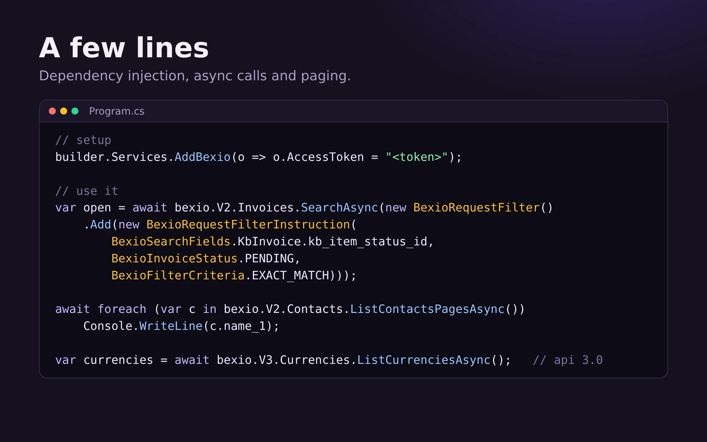

# Getting started

## Install

```
dotnet add package Bexio.DotNet
```

> Until the first release is published on nuget.org, reference the project directly or build the package from source with `dotnet pack bexio-api/bexio-lib`.

## With dependency injection (ASP.NET Core, worker services)

```csharp
// appsettings.json
// "Bexio": { "AccessToken": "<personal access token>" }
builder.Services.AddBexio(builder.Configuration.GetSection("Bexio"));
```

or in code:

```csharp
builder.Services.AddBexio(o => o.AccessToken = "<personal access token>");
```

This registers a typed `HttpClient` (via `IHttpClientFactory`), `IBexioClient`, `IBexioClientFactory` and every single endpoint interface.

`BexioOptions`:

| Option | Default | Meaning |
|---|---|---|
| `AccessToken` | - | Static bearer token (personal access token) |
| `AccessTokenProvider` | - | Async callback delivering the token per request, takes precedence (used by OAuth2) |
| `BaseUrl` | `https://api.bexio.com` | Api base url **without** version. A trailing `/2.0` is ignored |
| `MaxRetries` | 3 | Retries after 429 / 503 |
| `RetryBaseDelay` | 500 ms | First delay, doubled each attempt; a `Retry-After` header wins |
| `RetryMaxDelay` | 30 s | Upper bound of one delay |
| `Timeout` | 100 s | Timeout of the HttpClient |

The older `services.AddBexioJwt(configuration)` (keys `bexioApiKey` and `bexioApiUrl`) still works.

## First call



Inject `IBexioClient`:

```csharp
public class InvoiceService(IBexioClient bexio)
{
    public Task<ICollection<BexioInvoice>> Open() =>
        bexio.V2.Invoices.SearchAsync(new BexioRequestFilter()
            .Add(new BexioRequestFilterInstruction(
                BexioInvoiceFilterFields.kb_item_status_id,
                BexioInvoiceStatus.PENDING,
                BexioFilterCriteria.EXACT_MATCH)));
}
```

or just the endpoint you need:

```csharp
public class ContactsController(IBexioApiContactEndpoint contacts) { ... }
```

## Without dependency injection

```csharp
var factory = new BexioClientFactory();
IBexioClient client = factory.Create("<personal access token>");
var contacts = await client.V2.Contacts.GetAllAsync();
```

`BexioClientFactory` shares one `HttpClient` between all clients created without DI. For more control pass `BexioOptions`: `factory.Create(new BexioOptions { ... })`.
