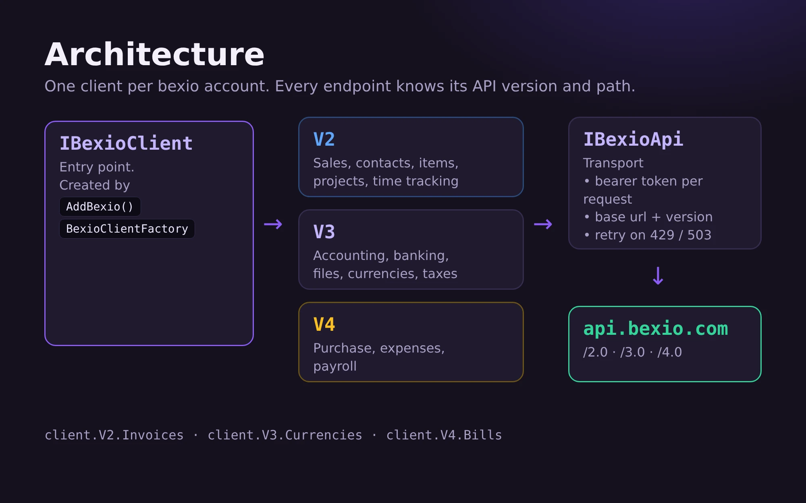

# bexio-dotnet documentation

A .NET client for the [bexio](https://www.bexio.com) API (2.0 and 3.0).

| Guide | Content |
|---|---|
| [Getting started](getting-started.md) | Install, set up with or without dependency injection, first call |
| [Authentication](authentication.md) | Personal access token and OAuth2 (apps registered at bexio), token store, several bexio accounts |
| [Usage](usage.md) | Reading, searching with filters, paging, create / update / delete, errors, retries, extending |
| [Endpoint reference](endpoints.md) | Every endpoint with interface, api resource and supported operations |
| [Testing](testing.md) | Test code that uses the library; run the library's own tests |
| [Releasing](releasing.md) | CI, versioning and publishing to NuGet |

Requirements: .NET 10 (LTS).

## Concepts in one minute



```
IBexioClient                      entry point, one per bexio account
 ├─ V2 / V3                        endpoints grouped by api version
 │   └─ Contacts, Invoices, ...   one endpoint per bexio resource
 └─ Api (IBexioApi)               transport: auth header, base url, retry
```

- Every endpoint knows its own api version and path. You never configure versions.
- Entities (`BexioContact`, `BexioInvoice`, ...) mirror the bexio json, property names are snake_case like the api.
- Failed requests throw `BexioApiException` (with `StatusCode` and the raw `Content`).
- Rate limits (HTTP 429) and 503 are retried automatically.
